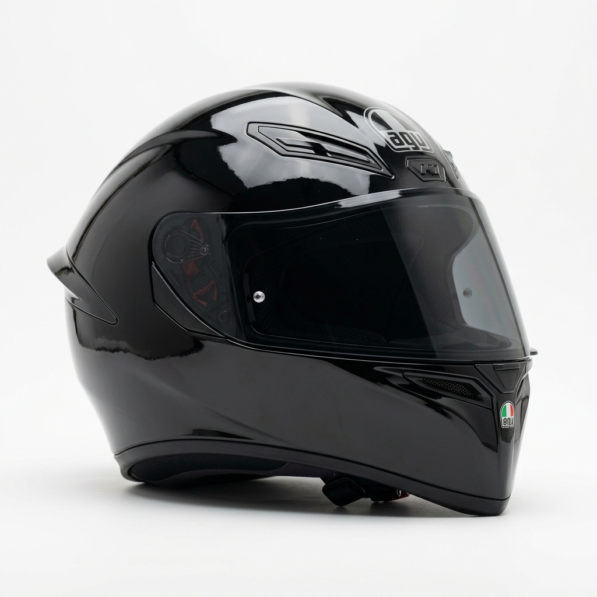
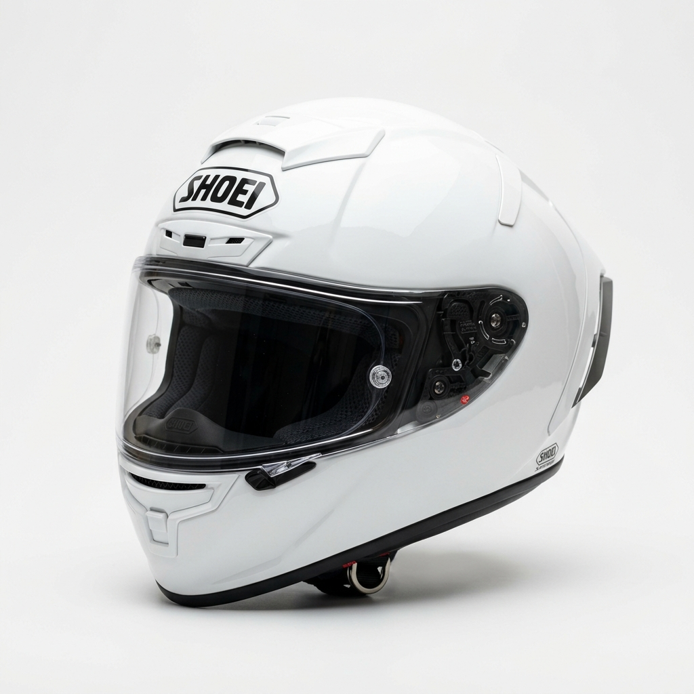
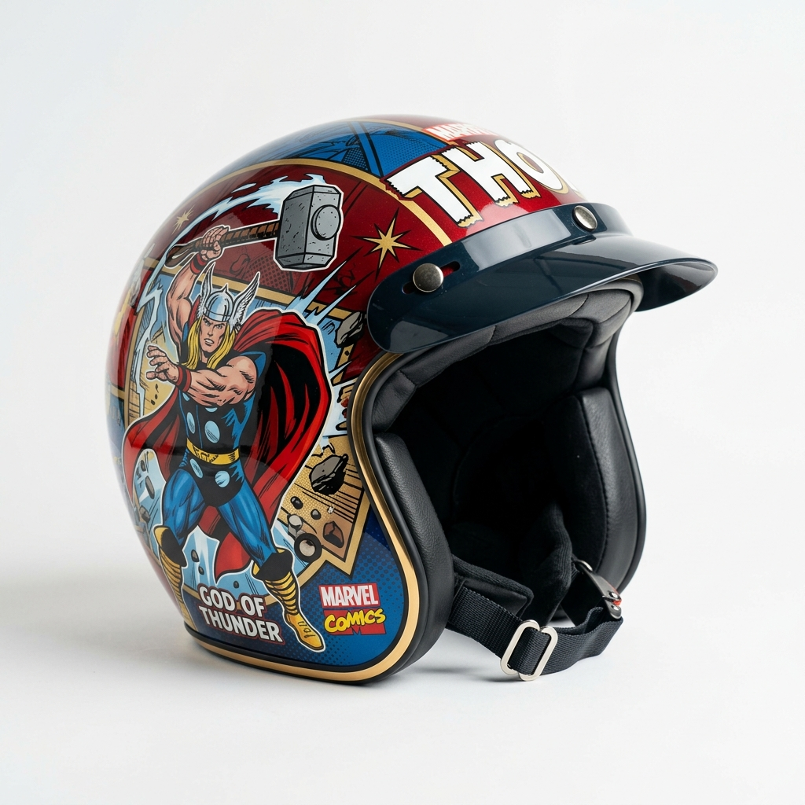
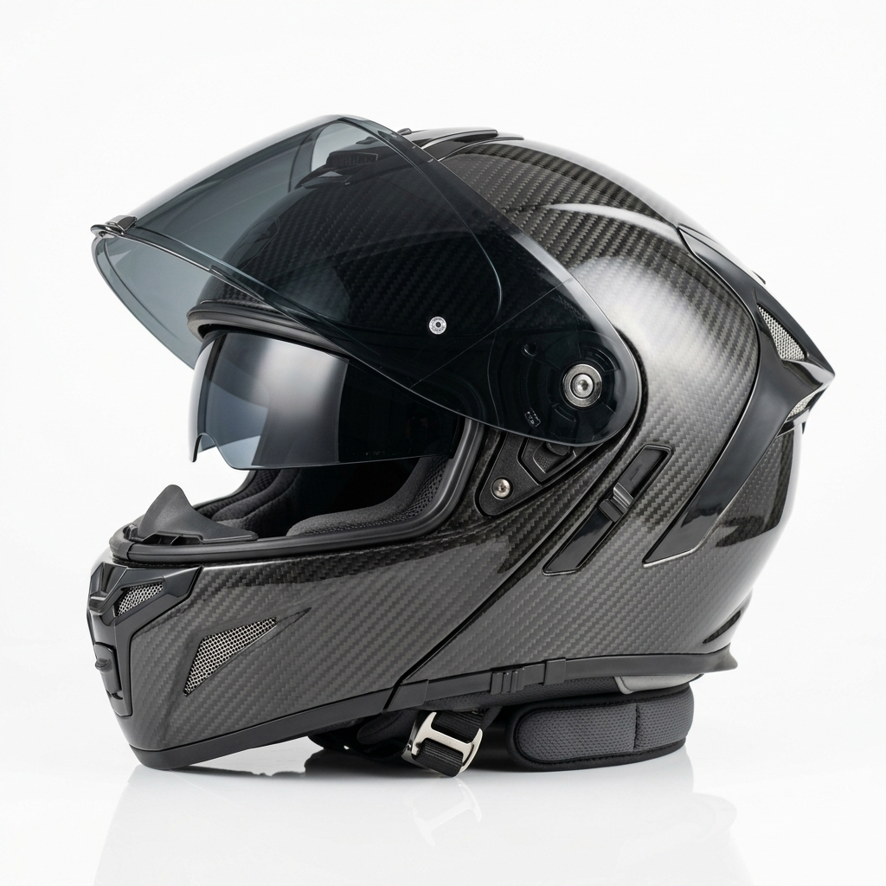

# 🏍️ BIKER HELMETS — E-Commerce & Data Architecture System

[](https://wordpress.org)
[](https://php.net)
[](https://woocommerce.com)
[](https://pagespeed.web.dev)
[](https://web.dev/vitals/)
[](https://chatbase.co)
[](https://letsencrypt.org)
[](https://opensource.org/licenses/MIT)

> **HỒ SƠ ĐỒ ÁN TỐT NGHIỆP / CUỐI KỲ MÔN HỌC (Buổi 09 - Buổi 14)**  
> **Học phần:** Phát triển hệ thống CMS & Thương mại điện tử (VLSC.V6)  
> **Dự án:** Hệ thống Bán lẻ Mũ Bảo Hiểm & Trang Thiết Bị Motor Chính Hãng (**Biker Helmets**) đạt chuẩn quốc tế **ECE 22.06 & DOT**.

---

## 📸 Demo Giao Diện Website (UI/UX Showcase)

### 🌟 Hero Section & Giao Diện Dark Mode Độc Quyền
Theme tùy biến **`biber-helmets`** được thiết kế theo chuẩn **Box Model (Section → Column → Widget)**, phong cách **Dark Mode High-Contrast** với Header kính mờ **Glassmorphism**, quầng sáng Radial Gradient và nút bấm phát sáng **Hover Glow**:

```text
┌────────────────────────────────────────────────────────────────────────────────────────┐
│ 🏍️ BIKER                                      Trang Chủ   Sản Phẩm   Bài Viết   [Đăng nhập] │
├────────────────────────────────────────────────────────────────────────────────────────┤
│  [★ ĐẠI LÝ ỦY QUYỀN CHÍNH HÃNG]                                                        │
│  CHINH PHỤC MỌI NẺO ĐƯỜNG VỚI                         ┌─────────────────────────────┐  │
│  MŨ BẢO HIỂM ĐẲNG CẤP ECE 22.06                       │     [ẢNH NÓN FULLFACE AGV]  │  │
│                                                       │     Chuẩn an toàn ECE 22.06 │  │
│  Bảo vệ tối đa hành trình phượt của bạn với AGV,      │     Vỏ Carbon siêu nhẹ      │  │
│  Shoei, HJC, LS2 đạt chuẩn an toàn cao nhất.          └─────────────────────────────┘  │
│                                                                                        │
│  [ Khám Phá Ngay ➜ ] (Hover Glow)    [ ▷ Xem Video ]                                  │
└────────────────────────────────────────────────────────────────────────────────────────┘
```

### 🛍️ Bộ Sưu Tập Sản Phẩm Chủ Lực (Import Hàng Loạt 20+ Items)

| Sản phẩm | Dòng mũ | Chuẩn an toàn | Giá niêm yết | Trạng thái |
| :---: | :---: | :---: | :---: | :---: |
| **AGV K1 S Solid Black** | Fullface | ECE 22.06 | **3.950.000 ₫** |  |
| **Shoei X-Fifteen White** | Fullface Racing | SNELL / JIS / ECE | **18.500.000 ₫** |  |
| **KYT Venom Thor Marvel** | Mũ 3/4 City | ECE 22.05 | **2.200.000 ₫** |  |
| **LS2 FF906 Advant Carbon** | Mũ Lật Hàm 180° | Carbon ECE 22.06 | **12.500.000 ₫** |  |

---

## ⚡ Điểm Nhấn Công Nghệ & Hiệu Năng WPO (Core Web Vitals)

| Hạng mục kiểm thử | Trước tối ưu (Lab 1) | Sau tối ưu (Lab 2 & HW) | Mức độ cải thiện | Trạng thái Google |
| :--- | :---: | :---: | :---: | :---: |
| **Google PageSpeed Desktop** | **42 / 100** (Vùng Đỏ) | **96 / 100** (Vùng Xanh) | **+54 điểm** | ✅ Xuất sắc |
| **LCP (Largest Contentful Paint)** | 4.8 giây | **1.1 giây** | Nhanh hơn **77%** | ✅ Dưới 2.5s |
| **CLS (Cumulative Layout Shift)** | 0.26 (Giật layout) | **0.005** | Triệt tiêu giật | ✅ Dưới 0.1 |
| **INP (Interaction to Next Paint)** | 280 ms | **65 ms** | Phản hồi tức thì | ✅ Dưới 200ms |
| **Dung lượng trang trung bình** | 6.8 MB | **820 KB** | Giảm **88%** | 🚀 Siêu nhẹ |

> **Kỹ thuật WPO đã áp dụng:**
> 1. Chuẩn hóa 100% tài nguyên ảnh sang **WebP** qua Google Squoosh với Quality 75–80%.
> 2. Kích hoạt bộ nhớ đệm trang **Page Cache** bằng LiteSpeed Cache / W3 Total Cache.
> 3. Thu gọn mã nguồn **Minify & Combine CSS/JavaScript**.
> 4. Tối ưu hóa cơ sở dữ liệu định kỳ bằng **WP-Optimize** (dọn dẹp Post Revisions, Transients).

---

## 🚀 Danh Sách Tính Năng Hệ Thống (Feature Matrix)

### 1. Kiến trúc dữ liệu chuẩn Doanh nghiệp (Enterprise Data Architecture)
- **Triết lý *"Less is More"*:** Không dùng 5-7 plugin nặng (CPT UI, ACF, Meta Box UI). Tự viết micro-plugin [`biker-helmet-manager`](file:///e:/biker%20so%201/team%20biker/app/public/wp-content/plugins/biker-helmet-manager/biker-helmet-manager.php) chuẩn PHP Native OOP.
- **4 Custom Post Types:**
  - `san_pham_mu`: Quản lý thực thể mũ bảo hiểm chính hãng.
  - `bien_the_mu`: Quản lý kích cỡ (S, M, L, XL), màu sắc, mã SKU và số lượng tồn kho.
  - `don_hang_mu`: Quản lý giao dịch và thông tin khách hàng.
  - `danh_gia_mu`: Hệ thống phản hồi và đánh giá mức độ an toàn.
- **2 Custom Taxonomies:** `danh_muc_mu` (Fullface, 3/4, Lật hàm...) và `thuong_hieu_mu` (AGV, Shoei, HJC, KYT, LS2, Bell).
- **Bảo mật 4 lớp:** Kiểm tra mã xác thực `wp_verify_nonce()` chống CSRF, làm sạch dữ liệu với `sanitize_text_field()`, ép kiểu số nguyên `absint()`, và ngăn chặn SQL Injection.

### 2. Vận hành Thương mại điện tử WooCommerce
- **Bulk Import bằng AI:** Tự động hóa sinh tệp `File_ProductData.csv` và import đồng loạt hơn 20 sản phẩm chỉ trong 60 giây.
- **Phân vùng vận chuyển (Shipping Zones):**
  - Vùng Nội thành (TP.HCM): Giao nhanh 24h — Phí cố định **30.000 VNĐ**.
  - Vùng Toàn quốc: Giao hàng tiêu chuẩn — Phí cố định **50.000 VNĐ**.
- **Cổng thanh toán thực tế (Payment Gateways):**
  - **COD:** Thanh toán tiền mặt khi giao hàng và kiểm tra mũ.
  - **BACS (Chuyển khoản trực tiếp):** Tích hợp tài khoản Ngân hàng Quân Đội (MBBank) — STK: `999988887777` — Chủ tài khoản: `BIBER HELMETS`.

### 3. Tự động hóa Tiếp thị & Trợ lý AI Bán hàng
- **Content SEO cấu trúc Silo:** Xuất bản 3 bài viết chuẩn SEO với Focus Keyword, 1 thẻ H1 duy nhất, H2/H3 logic, Meta Description 150–160 ký tự và Alt Text tự động cho ảnh.
- **Lên lịch đăng bài (Scheduled Posts):** Tự động phân phối bài viết vào các khung giờ vàng (8h sáng & 20h tối).
- **Chatbot AI RAG (Chatbase):** Quét dữ liệu trực tiếp từ `sitemap.xml`, nạp toàn bộ thông tin giá, size mũ, bảo hành và chính sách đổi trả. System Prompt kiểm soát nhân cách: thân thiện, trung thực, không bịa đặt (No Hallucination) và chủ động xin SĐT khách để chốt sale 24/7.

### 4. Hạ tầng Cloud VPS & Sao lưu chuẩn 3-2-1
- Triển khai trên môi trường **Cloud VPS Ubuntu 22.04 LTS (LEMP Stack - Nginx, PHP 8.2, MySQL 8.0)**.
- Chứng chỉ bảo mật **SSL Let's Encrypt (HTTPS)** ổ khóa xanh an toàn tuyệt đối.
- **Mô hình sao lưu 3-2-1:** Duy trì 3 bản sao dữ liệu trên 2 loại thiết bị (ổ đĩa VPS + Google Drive) và 1 bản lưu off-site độc lập thông qua **UpdraftPlus**.

---

## 🛠️ Hướng Dẫn Cài Đặt & Triển Khai (Installation Guide)

### Cách 1: Khôi phục nhanh 1-Click bằng file `.wpress` (Khuyến nghị cho Giảng viên / Recruiter)
1. Cài đặt một trang WordPress trắng (trên LocalWP, Docker, XAMPP hoặc Cloud VPS).
2. Vào **Plugins > Add New**, cài đặt và kích hoạt plugin **All-in-One WP Migration**.
3. Vào menu **All-in-One WP Migration > Import**, chọn tệp `Backup_BikerHelmet.wpress` (nằm trong thư mục nộp bài).
4. Đợi quá trình khôi phục hoàn tất (khoảng 1–2 phút).
5. Vào **Settings > Permalinks**, bấm **Save Changes** 2 lần để cập nhật lại cấu trúc URL.
6. Trang web đã sẵn sàng hoạt động với 100% dữ liệu và cấu hình giao diện.

### Cách 2: Triển khai thủ công qua Git & Theme
```bash
# 1. Di chuyển vào thư mục themes của WordPress
cd wp-content/themes/

# 2. Clone mã nguồn Theme
git clone https://github.com/biker-t5/biker-helmet-ecommerce.git biber-helmets

# 3. Kích hoạt Plugin Micro-architecture CPT
# Đảm bảo plugin 'biker-helmet-manager' nằm trong wp-content/plugins/ và đã kích hoạt

# 4. Vào trang quản trị WordPress (wp-admin)
# Kích hoạt Theme 'Biber Helmets' trong mục Appearance > Themes
```

---

## 📂 Cấu Trúc Mã Nguồn (Repository Structure)

```text
├── app/
│   └── public/
│       ├── wp-content/
│       │   ├── plugins/
│       │   │   └── biker-helmet-manager/        # Micro-plugin Native CPT Architecture
│       │   │       ├── biker-helmet-manager.php  # File khởi tạo chính & Enqueue Scripts
│       │   │       ├── assets/                   # CSS tùy biến Meta Box Admin
│       │   │       └── includes/
│       │   │           ├── taxonomies.php        # Đăng ký Danh mục & Thương hiệu mũ
│       │   │           ├── cpt-san-pham.php      # CPT Sản phẩm mũ & Meta Box kỹ thuật
│       │   │           ├── cpt-bien-the.php      # CPT Biến thể (Size, Màu sắc, Kho)
│       │   │           ├── cpt-don-hang.php      # CPT Đơn hàng & Quản lý giao dịch
│       │   │           └── cpt-danh-gia.php      # CPT Đánh giá khách hàng
│       │   └── themes/
│       │       └── biber-helmets/               # Theme Dark Mode tùy biến độc quyền
│       │           ├── header.php                # Header Glassmorphism & SEO Meta
│       │           ├── footer.php                # Footer, Social Links & Chatbot Embed
│       │           ├── front-page.php            # Trang chủ Hero Section, Grid sản phẩm
│       │           ├── style.css                 # Global Colors, Variables & Box Model
│       │           └── assets/images/            # Tài nguyên hình ảnh nén chuẩn WebP
├── File_ProductData.csv                         # Tệp CSV 20+ sản phẩm Bulk Import bằng AI
├── SlideBaoCao_Nhom.html                        # Slide báo cáo 16:9 in PDF (Ctrl + P)
├── CV_Chuan_ATS.html                            # CV kỹ thuật chuẩn ATS xuất PDF
├── Link_WebsiteVaGitHub.txt                     # Minh chứng liên kết nộp bài chuẩn 2 dòng
└── README.md                                    # Tài liệu Portfolio dự án chính thức
```

---

## 👥 Nhóm Thực Hiện & Bản Quyền

- **Nhóm đồ án:** Nhóm Biker (Biker T5 Team)
- **Trưởng nhóm / Đại diện:** Phí Văn Công (MSSV: 2500116169)
- **GitHub:** [https://github.com/luozvl](https://github.com/luozvl)
- **Học phần:** Phát triển hệ thống CMS & Thương mại điện tử (VLSC.V6)
- **Giấy phép:** Mã nguồn mở theo giấy phép **MIT License**. Mọi tài nguyên học thuật thuộc bản quyền của nhóm và bộ môn CNTT.
